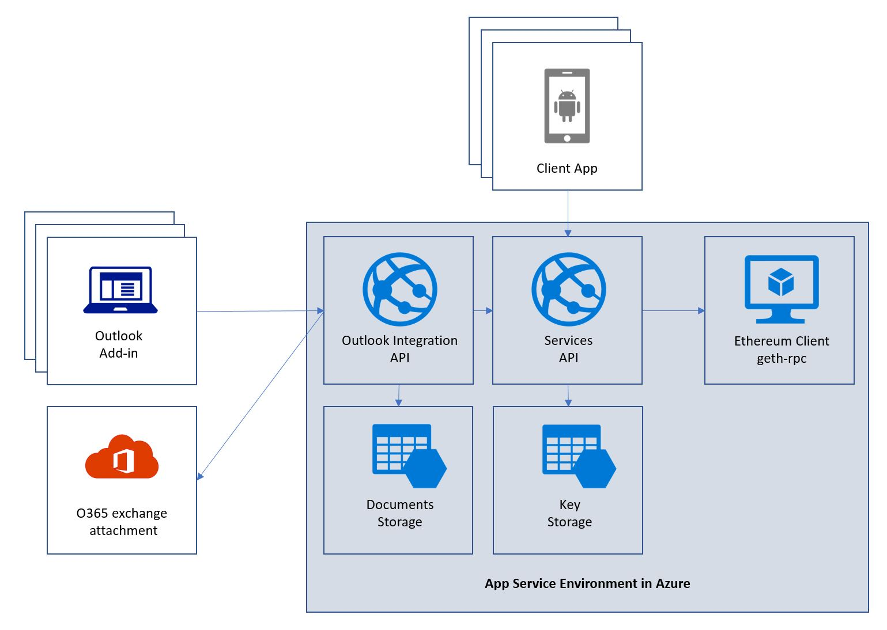

# blockchain-supply-chain

## Overview
This is the "umbrella" repository for blockchain supply-chain solution. The solution implements an end-to-end document and device data attestation scenario:
* The [Office 365 outlook integration](https://github.com/Azure/supply-chain-office-integration) supports archiving, retrieval and validations of attachments. 
* The [Core services](https://github.com/Azure/supply-chain-services) provide an API to interact with the [Ethereum smart contract](https://github.com/Azure/supply-chain-smart-contracts). This contract implements the persistency of a proof (such as a laboratory report of a produce). The core service [README.md](https://github.com/Azure/supply-chain-services/blob/master/README.MD) explains the API in more detail. In addition to the interaction with the smart contract, the core services implement a key store which is used to encrypt the private parts of a proof. 

## Architecture


## Cloning the repo
```
git clone
git submodule init 
git submodule update --init --remote
git submodule foreach git checkout master
```

## Getting started locally
* [Build and deploy the smart contract to the block chain](https://github.com/Azure/supply-chain-smart-contracts/blob/master/README.md) - for local development you either use `testrpc` or a local `geth` instance.
* [Configure and run the core service](https://github.com/Azure/supply-chain-services) - update the configuration as described in the README and run the service using `npm start`
* [Configure and run the office integration service](https://github.com/Azure/supply-chain-office-integration) - Follow the instructions in on `configuration` and `running in localhost`

## Deploying the solution to Azure
To deploy the solution to Azure, follow [these](https://github.com/Azure/blockchain-supply-chain-solution/tree/master/azure-deployment) instructions.
